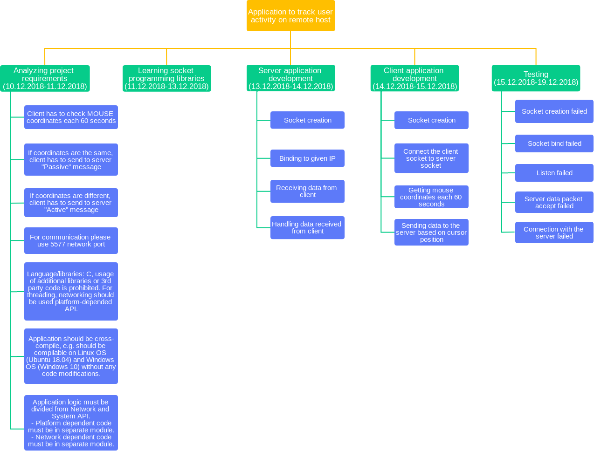

# GL C BaseCamp Task 1

GL BaseCamp console tasks:
(C, Networking, System API)

The following approaches are required:
- Console application.
- “make” file to compile application.
- Language/libraries: C, usage of additional libraries or 3rd party code is prohibited. For threading, networking should be used platform-depended API. (details can be discussed individually with assigned mentor).
- Application should be cross-compile, e.g. should be compilable on Linux OS (Ubuntu 18.04) and Windows OS (Windows 10) without any code modifications.
It's allowed to use C99 and C11.
 
Application logic must be divided from Network and System API.
  - Platform dependent code must be in separate module.
  - Network dependent code must be in separate module.

Client/Server application to track user activity on remote host.
  - Client has to check MOUSE coordinates each 60 seconds.
  - If coordinates are the same, client has to send to server "Passive" message.
  - If coordinates are different, client has to send to server "Active" message.
  - For communication please use 5577 network port.

